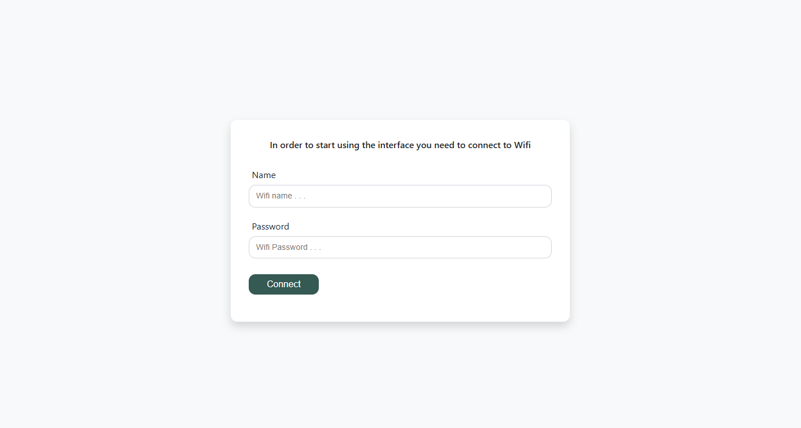
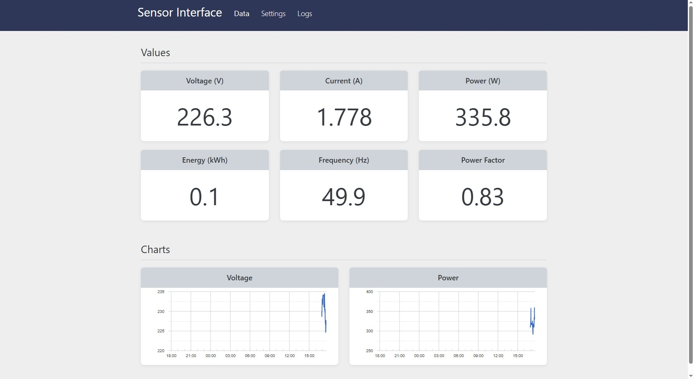
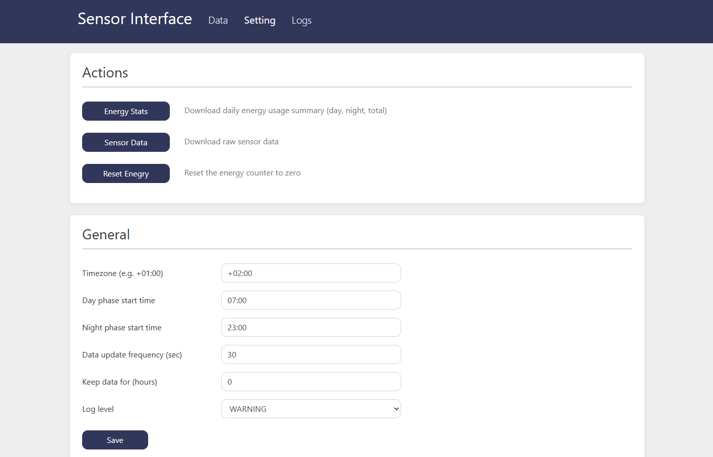

# ⚡ Energy Consumption Controller

[](https://platformio.org/)
[](https://www.espressif.com/en/products/socs/esp8266)
[](#hardware-requirements)
[](LICENSE)

> **Professional-grade AC power monitoring system** for home and industrial applications. Monitor voltage, current, power consumption, and energy usage with real-time web interface and historical analytics.

## ✨ Features Overview

**📊 Real-time Power Monitoring**
- Live voltage, current, power, energy, frequency, and power factor readings
- Interactive charts showing consumption trends over time
- Day/night energy consumption tracking with separate statistics

**🌐 Smart Web Interface**
- Fully responsive design - works on mobile, tablet, and desktop
- WebSocket-based real-time updates (no page refreshing needed)
- WiFi setup portal with automatic fallback to Access Point mode
- Real-time system logs

**💾 Intelligent Data Management**
- Automatic CSV data logging with configurable intervals
- Configurable data retention periods to manage storage
- Energy statistics export for day/night consumption analysis
- FTP server for bulk file operations and remote access

**🔧 Advanced System Features**
- Over-the-air (OTA) firmware updates without USB cable
- Automatic NTP time synchronization with timezone support
- Dual WiFi mode operation (Access Point + Station)
- System reliability with watchdog protection and auto-restart

## 🎯 Why Choose This Controller?

✅ **Industrial Accuracy** - 0.5% measurement precision with PZEM sensors  
✅ **Real-time Monitoring** - Live data streaming with interactive charts  
✅ **Smart Data Management** - Automatic CSV logging with configurable retention  
✅ **Mobile-First Design** - Responsive web interface works on any device  
✅ **Professional Features** - OTA updates, FTP access, advanced analytics  
✅ **Easy Setup** - WiFi portal setup, automatic network recovery  
✅ **Reliable Operation** - 24-hour auto-restart, memory monitoring, error recovery  
✅ **Developer Friendly** - Full API, WebSocket support, modular architecture  

## 📋 Table of Contents

- [⚠️ Safety & Prerequisites](#️-safety--prerequisites)
- [🛠️ Hardware Requirements](#️-hardware-requirements)
- [🚀 Quick Start](#-quick-start)
- [📱 Detailed Setup](#-detailed-setup)
- [🌐 Web Interface Guide](#-web-interface-guide)
- [🔄 API Reference](#-api-reference)
- [📂 Project Structure](#-project-structure)
- [🔧 Troubleshooting](#-troubleshooting)

---

## ⚠️ Safety & Prerequisites

### ⚡ Important Safety Notice

> **Working with AC Power**  
> This project measures AC mains voltage. While the PZEM sensors provide isolation, basic electrical safety is important. Turn off power when making connections and double-check your wiring.

**Basic Safety Steps:**
- ⚡ Turn off circuit breaker when connecting wires
- 🔌 Use proper wire connections (no loose wires)
- 📦 Keep electronics in a suitable enclosure
- 🔍 Double-check connections before powering on

### 📋 What You Need to Know

**Coding Experience:**
- **None required!** Just follow the setup instructions
- Copy and paste - the code is ready to use
- Basic computer skills (downloading, uploading files)

**Basic Electronics:**
- Connecting wires (positive, negative, data lines)
- Using a USB cable to program the ESP8266
- Basic understanding that electricity can be dangerous

### ⏱️ Time Estimate

- **Hardware assembly**: 1-2 hours (simple wire connections)
- **Software setup**: 15-30 minutes (mostly downloading and uploading)
- **Getting it working**: Usually works right away if wired correctly

### 🛡️ Quick Safety Checklist

- [ ] I'll turn off power when connecting wires
- [ ] I'll double-check connections before turning power back on  
- [ ] I understand this involves electrical work (but it's manageable)
- [ ] I'll ask for help if I'm unsure about anything

---

## 🛠️ Hardware Requirements

### 📦 Shopping List

#### **Core Components**

**ESP8266 Development Board**
- Any ESP8266 board with accessible GPIO pins
- Examples: NodeMCU, Wemos D1 Mini, ESP-01 (with adapter), etc.
- Must have 3.3V and 5V power available
- USB programming interface recommended for easy setup

**Power Monitoring Sensor:**

| Model | Max Current | Best For |
|-------|-------------|----------|
| **PZEM-014** | 10A | Household circuits, small appliances |
| **PZEM-016** | 100A | Main panels, large loads (needs external CT) |

> 📖 **Detailed specifications**: See [PZEM-014/016 Technical Manual](docs/PZEM-014,016%20specification.pdf) for complete electrical specifications and communication protocol details.

**Note**: This project is specifically designed for PZEM-014/016 sensors due to their Modbus RTU communication protocol. Other power sensors would require code modifications.

#### **Additional Components**
- **Jumper wires** (male-to-female, 4 pieces minimum)
- **5V Power supply** (USB phone charger works fine)
- **Project enclosure** (optional but recommended for permanent installation)

### 🔌 Component Selection Guide

**Choose PZEM-014 if:**
- ✅ Monitoring individual appliances or circuits under 10A
- ✅ Want simpler installation (built-in current measurement)
- ✅ Most household applications (lights, outlets, small appliances)

**Choose PZEM-016 if:**
- ✅ Monitoring main electrical panel or large loads
- ✅ Need to measure over 10A (up to 100A)
- ✅ Already have or can install current transformer (CT)

### 🔧 Wiring & Connections

#### **ESP8266 to PZEM Connection**
```
ESP8266                PZEM-014/016
==================    ============
5V or VIN        -->  VCC (+5V)
GND              -->  GND  
GPIO13 (D7)*     -->  TX (Data out from PZEM)
GPIO15 (D8)*     -->  RX (Data in to PZEM)
```
*Pin numbers may vary by board - check your specific ESP8266 board pinout

#### **PZEM Power Connections**

⚡ **IMPORTANT**: Turn off circuit breaker before making these connections!

**For PZEM-014:**
- Connect **L** (Live/Hot) wire through the device  
- Connect **N** (Neutral) wire through the device
- Built-in current sensing - no external wires needed

**For PZEM-016:**
- Connect **L** and **N** for voltage sensing
- Install **current transformer (CT)** around the main wire
- CT connects to designated terminals on PZEM-016

> 🔗 **Detailed wiring diagrams**: See figures 4.1 and 4.2 in the [PZEM Technical Manual](docs/PZEM-014,016%20specification.pdf) for complete wiring instructions and safety guidelines.

### 📋 Optional Accessories

- **Project enclosure**: Protect electronics (DIN rail mount available)
- **Heat shrink tubing**: Professional wire connections
- **Terminal blocks**: Easier wire connections
- **Current transformer**: Required for PZEM-016 (usually included)

---

## 🚀 Quick Start

> **For experienced users** - Get running in 30 minutes. Need more detail? Jump to [Detailed Setup](#-detailed-setup).

**Prerequisites:** [PlatformIO](https://platformio.org/) installed (VS Code extension or CLI)

### **Step 1: Wire Hardware**
```
ESP8266 → PZEM-014/016
5V/VIN  → VCC
GND     → GND  
GPIO13  → TX
GPIO15  → RX
```
Connect PZEM to your AC circuit (⚡ **power off first**). See [PZEM Technical Manual](docs/PZEM-014,016%20specification.pdf) for detailed wiring instructions.

### **Step 2: Clone & Setup**
```bash
git clone https://github.com/tsaplia/energy-controller-refactored.git
cd energy-controller-refactored
```

### **Step 3: Build & Upload**
```bash
platformio run --target upload          # Upload firmware via USB
platformio run --target uploadfs        # Upload web interface files
```
*Or use VS Code PlatformIO extension buttons*

### **Step 4: Configure WiFi**
1. ESP creates AP `ESP8266-Sensor` (password: `password`)
2. Connect and enter your WiFi credentials  
3. Device connects to your network and shows IP address
4. **AP automatically disconnects** - reconnect to your home WiFi network
5. Access web interface using the displayed IP address

### **Step 5: Access Interface**
- Find ESP IP address (router admin or serial monitor)
- Open `http://ESP_IP_ADDRESS` in browser
- Start monitoring power consumption!

### **⚡ Quick Troubleshooting**
- **No sensor data?** → Check wiring, verify PZEM power
- **Can't connect to WiFi?** → Reset and try AP mode again  
- **Upload failed?** → Check USB cable, try different port
- **Web interface not loading (Error 404)?** → Verify filesystem upload completed

📖 **Need help?** See [Detailed Setup](#-detailed-setup) or [Troubleshooting](#-troubleshooting) sections.

---

## 📱 Detailed Setup

> **Step-by-step guide for beginners** - No prior experience needed!

### **Step 1: Install Development Environment**

#### **Option A: VS Code + PlatformIO (Recommended)**
1. **Download VS Code**: Go to [code.visualstudio.com](https://code.visualstudio.com/) and install
2. **Install PlatformIO extension**:
   - Open VS Code
   - Click Extensions icon (left sidebar) 
   - Search "PlatformIO IDE"
   - Click Install on the official extension
   - **Wait for PlatformIO Core to download and install** (this may take several minutes)
   - Restart VS Code when prompted

> ⚠️ **Important**: Wait for PlatformIO to fully initialize before opening projects. If you encounter project configuration issues, try: **View → Command Palette → "PlatformIO: Rebuild IntelliSense Index"**

#### **Option B: PlatformIO CLI**
1. **Install Python** (if not already installed)
2. **Install PlatformIO Core**:
   ```bash
   pip install platformio
   ```

### **Step 2: Download Project Files**

#### **If you have Git:**
```bash
git clone https://github.com/tsaplia/energy-controller-refactored.git
cd energy-controller-refactored
```

#### **If you don't have Git:**
1. Go to the project's GitHub page
2. Click green "Code" button → "Download ZIP"  
3. Extract ZIP file to a folder
4. Remember the folder location

### **Step 3: Hardware Assembly**

#### **Gather Your Components**
- ESP8266 board (any model with GPIO pins)
- PZEM-014 or PZEM-016 sensor
- 4 jumper wires (male-to-female)
- USB cable for ESP8266

#### **Make Connections**
⚡ **IMPORTANT**: Do this with power OFF!

1. **Connect ESP8266 to PZEM**:
   ```
   ESP8266 Pin    →    PZEM Pin
   ============        =========
   5V or VIN      →    VCC
   GND            →    GND  
   GPIO13 (D7)*   →    TX
   GPIO15 (D8)*   →    RX
   ```
   *Pin labels may vary - check your board's pinout

2. **Connect PZEM to AC Power** (⚡ **Turn off circuit breaker first!**):
   - **PZEM-014**: Connect Live and Neutral wires through the device
   - **PZEM-016**: Connect L/N for voltage, install CT for current
   - See [PZEM Technical Manual](docs/PZEM-014,016%20specification.pdf) for detailed wiring diagrams

3. **Double-check all connections** before powering on

### **Step 4: Configure & Upload Software**

#### **Open Project**
- **VS Code**: File → Open Folder → Select your project folder
- **CLI**: Navigate to project folder in terminal

#### **Upload Firmware**

**Using VS Code:**
1. Click PlatformIO icon in left sidebar
2. Under "PROJECT TASKS" → "nodemcuv3" → "General"
3. Click "Upload" (this compiles and uploads firmware)
4. Wait for "SUCCESS" message

**Using CLI:**
```bash
platformio run --target upload
```

#### **Upload Web Interface Files**

**Using VS Code:**
1. Same location as above
2. Click "Upload Filesystem Image"
3. Wait for completion

**Using CLI:**
```bash
platformio run --target uploadfs
```

### **Step 5: First Boot & WiFi Setup**

#### **What to Expect**
1. **ESP8266 starts** and creates its own WiFi network
2. **Network name**: `ESP8266-Sensor` (password: `password`)
3. **Connection process**:
   - Connect your phone/computer to ESP8266's WiFi
   - Open any webpage - it will redirect to setup page
   - Enter your home WiFi name and password
   - Device connects to your network and **displays IP address on the page**
   - **AP automatically disconnects** - you must reconnect to your home WiFi network to access the web interface


  
#### **Find Your Device**
**Method 1 - Router Admin:**
- Log into your router (usually 192.168.1.1 or 192.168.0.1)
- Look for new device in connected devices list

**Method 2 - Serial Monitor:**
- Keep USB cable connected
- Open serial monitor in PlatformIO (9600 baud)
- Device will print its IP address

### **Step 6: Access Web Interface**

1. **Open browser** and go to: `http://YOUR_ESP_IP_ADDRESS`
2. **You should see** the energy monitoring dashboard
3. **If sensor is connected properly**, you'll see live voltage/current/power readings

### **🎉 Success! What Now?**

- **Dashboard**: View real-time power consumption
- **Settings**: Configure data intervals, timezones, export your energy data, etc.
- **Logs**: Monitor system operation

### **❌ Something Not Working?**

**No sensor data showing?**
- Check wiring connections
- Verify PZEM has power (AC connected)
- Try different GPIO pins if needed

**Can't connect to WiFi?**
- Reset ESP8266 (power cycle)
- Try connecting to AP again
- Check WiFi password

**Upload failed?**
- Check USB cable connection
- Try different USB port
- Make sure ESP8266 drivers are installed

**Still stuck?** Check the [Troubleshooting](#-troubleshooting) section below!

---

## 🌐 Web Interface Guide

Once your device is connected to WiFi, open its IP address in your browser to access the monitoring interface.

### Dashboard Overview

The main dashboard provides real-time monitoring with:

#### **Live Data Display**
- **Real-time sensor readings** updated via WebSocket connection
- **Voltage, current, power, energy** consumption metrics
- **Frequency and power factor** measurements
- **Interactive charts** showing voltage and power trends over time

#### **Dashboard Features**
- 📱 **Fully responsive design** — works perfectly on mobile phones, tablets, and desktop
- 🔄 **Auto-updating data** — no need to refresh the page
- 📊 **Visual charts** — easily spot power consumption patterns


> 

### Settings Configuration

Access the settings page at `/settings` to configure your controller:

#### **Data Collection Settings**
- **Data Save Interval**: How often to record sensor data (default: 30 seconds)
- **Data Retention**: How long to keep historical data (default: 1 day)
- **Timezone Offset**: Set your local timezone for accurate timestamps

#### **Day/Night Phases**
- **Day Phase Start**: When "day" energy tracking begins (default: 7:00 AM)
- **Night Phase Start**: When "night" energy tracking begins (default: 11:00 PM)
- Automatically calculates separate day and night energy consumption

#### **System Settings**
- **Log Level**: Control detail level of system logs (DEBUG, INFO, WARNING, ERROR)
- **WiFi Credentials**: Update network connection settings
- **Energy Reset**: Reset energy counter to start fresh measurements

#### **Data Export**
- **Download sensor data**: Export CSV with all recorded measurements
- **Download energy stats**: Export day/night energy consumption summaries

> ⚠️ **WiFi Changes**: After updating WiFi credentials, the device will disconnect and connect to the new network. You'll need to find the new IP address to access the interface again.

> 

### System Logs

The logs page at `/logs` provides:

#### **Real-time Log Monitoring**
- **Live log stream** via WebSocket connection
- **Historical logs** from device storage
- **Timestamp information** for troubleshooting

#### **Log Categories**
- **DEBUG**: Detailed technical information
- **INFO**: General operational messages  
- **WARNING**: Important notices and state changes
- **ERROR**: Problems that need attention

---

## 🔄 API Reference

The controller provides a comprehensive HTTP API for automation and integration with other systems.

### 🔧 System Control Routes

| Route | Method | Description | Response |
|-------|---------|-------------|----------|
| `/api/restart` | GET | Restart the ESP8266 controller | `{"detail": "Restarting..."}` |
| `/api/pause` | GET | Pause data collection and processing | `{"detail": "Pausing..."}` |
| `/api/resume` | GET | Resume normal operation | `{"detail": "Resuming..."}` |
| `/api/system-info` | GET | Get detailed system information | JSON with chip, memory, filesystem data |
| `/api/clear-old` | GET | Remove old data based on retention settings | `{"detail": "Cleared old data"}` |

### ⚙️ Configuration Routes

| Route | Method | Description | Body | Response |
|-------|---------|-------------|------|----------|
| `/api/settings` | GET | Get current configuration | - | JSON with all settings |
| `/api/settings` | POST | Update configuration | JSON with settings to change | `{"detail": "OK"}` |
| `/api/reset-energy` | PUT | Reset energy measurement baseline | - | `{"detail": "OK"}` |
| `/api/connect-wifi` | POST | Update WiFi credentials | `{"ssid": "...", "password": "..."}` | `{"ip": "192.168.x.x"}` |

### 📡 WebSocket Endpoints

| Socket Path | Purpose | Message Format |
|------------|---------|----------------|
| `/ws/data` | Real-time sensor data | `{"type": "data", "data": {...}}` |
| `/ws/logs` | Live system logs | `{"type": "log", "data": "log message"}` |

#### **WebSocket Data Format**

**Sensor Data Messages:**
```json
{
  "type": "data",
  "data": {
    "time": 1640995200,
    "voltage": 230.5,
    "current": 2.150,
    "power": 495.6,
    "energy": "12.5",
    "frequency": 50.0,
    "pf": 0.95
  }
}
```

**Log Messages:**
```json
{
  "type": "log",
  "data": "2024-01-01 12:00:00 [INFO] WiFi connected on IP: 192.168.1.100"
}
```

### 📂 File Access Routes

| Route | Description |
|-------|-------------|
| `/sensor-data.csv` | Raw sensor measurements |
| `/energy-stats.csv` | Day/night energy summaries |
| `/configs.json` | Current device configuration |
| `/logs.txt` | System log file |

### 📥 FTP Access

Files can also be accessed via FTP for bulk operations:
- **Host**: ESP8266 IP address
- **User**: `esp`
- **Password**: `password`
- **Port**: 21 (standard FTP)

---

## 📂 Project Structure

Understanding the project layout helps you navigate the codebase and customize functionality as needed.

### 🗂️ Root Directory

```
energy-consumption-controller/
├── 📁 .vscode/                    # VS Code configuration
├── 📁 data/                       # Web interface files (uploaded to ESP8266)
├── 📁 docs/                       # Documentation and images
├── 📁 external-data/              # Stores large external resources not kept on the ESP8266
├── 📁 include/                    # C++ header files
├── 📁 lib/FTPClientServer-master/ # FTP server library
├── 📁 src/                        # C++ source code
├── 📄 .gitignore                  # Git ignore rules
├── 📄 LICENSE                     # Project license
├── 📄 README.md                   # This file
└── 📄 platformio.ini              # PlatformIO configuration
```

### 🌐 Web Interface Files (`/data`)

These files are uploaded to the ESP8266's filesystem and served by the web server:

```
data/
├── 📄 auth.html          # WiFi setup page (AP mode)
├── 📄 data.js            # WebSocket data handling
├── 📄 index.html         # Main dashboard page
├── 📄 logs.html          # System logs viewer
├── 📄 logs.js            # Log WebSocket handling
├── 📄 settings.html      # Configuration page
├── 📄 settings.js        # Settings management
├── 📄 shared.js          # Common JavaScript functions
└── 📄 style.css          # All page styling
external-data/
└── 📄 bootstrap.min.css  # Bootstrap styling, loaded via GitHub CDN instead of controller storage
```

### 🧠 Core Source Code (`/src`)

Main application logic organized by functionality:

```
src/
├── 📄 main.cpp           # Application entry point & setup
├── 📄 configs.cpp        # Configuration management
├── 📄 globals.cpp        # Global variables initialization
├── 📄 logger.cpp         # Logging system implementation
├── 📄 loop-handlers.cpp  # Main loop logic handlers
├── 📄 sensor.cpp         # PZEM sensor communication
├── 📄 utils.cpp          # Utility functions (time, files, etc.)
├── 📄 wifi-tools.cpp     # WiFi management (AP/STA modes)
└── 📁 web/               # Web server components
    ├── 📄 api-handlers.cpp    # HTTP API endpoint handlers
    ├── 📄 web-server.cpp      # Web server setup & routing
    └── 📄 web-utils.cpp       # Web utility functions
```

### 🔧 Header Files (`/include`)

Interface definitions and constants:

```
include/
├── 📄 configs.h          # Configuration class definition
├── 📄 constants.h        # System constants and defaults
├── 📄 globals.h          # Global variable declarations
├── 📄 logger.h           # Logging system interface
├── 📄 loop-handlers.h    # Loop handler function declarations
├── 📄 sensor.h           # Sensor data structures & functions
├── 📄 utils.h            # Utility function declarations
├── 📄 wifi-tools.h       # WiFi management interface
└── 📁 web/               # Web server headers
    ├── 📄 api-handlers.h      # API handler declarations
    ├── 📄 web-server.h        # Web server declarations
    └── 📄 web-utils.h         # Web utility declarations
```

### 🔍 Important Files to Know

#### **For Customization:**
- `platformio.ini` - Build configuration, board settings, libraries
- `main.cpp` - Add new sensors or modify startup behavior
- `constants.h` - Modify default settings, intervals, passwords
- `style.css` - Customize web interface appearance 

#### **For Troubleshooting:**
- `logger.cpp` - Understand logging system
- `wifi-tools.cpp` - WiFi connection issues
- `sensor.cpp` - PZEM communication problems

#### **For API Integration:**
- `api-handlers.cpp` - Add new API endpoints
- `web-server.cpp` - Modify routing or WebSocket behavior

### 💾 Runtime Files (Created on ESP8266)

When running, the controller creates these files in its filesystem:

```
ESP8266 Filesystem:
├── 📄 /configs.json          # Saved configuration
├── 📄 /sensor-data.csv       # Historical sensor readings  
├── 📄 /energy-stats.csv      # Daily/nightly energy summaries
└── 📄 /logs.txt              # System log history
```

---

## 🔧 Troubleshooting

### 🌐 Web Interface Issues

**Pages loading slowly or not fully:**
- **Try reloading** the page (Ctrl+F5 or Cmd+Shift+R)
- **Wait a few seconds** between page requests - ESP8266 has limited resources

**Charts not loading properly:**
- **Slow internet connection** may prevent all data from loading
- **Reduce data retention** in settings to keep less historical data
- Check your router for connection issues
- Try accessing `/api/restart` to restart the ESP8266 controller 

### 🛠️ PlatformIO Setup Issues

**Extension not working properly:**
- **Wait for PlatformIO Core** to fully download and install
- **Project configuration errors**: Go to **View → Command Palette → "PlatformIO: Rebuild IntelliSense Index"**
- **Build issues**: Try **PlatformIO: Clean** then **PlatformIO: Build**
- **Still having problems**: Restart VS Code and wait for initialization

### 🔌 Hardware & Connection Problems

**No sensor data showing:**
- Check wiring connections between ESP8266 and PZEM
- Verify PZEM has AC power connected
- Try different GPIO pins if needed
- Check serial monitor for sensor communication errors

**Can't connect to WiFi:**
- Reset ESP8266 (power cycle)
- Try connecting to AP mode again
- Check WiFi password spelling
- Ensure WiFi network is 2.4GHz (ESP8266 doesn't support 5GHz)

**Upload failed:**
- Check USB cable connection
- Try different USB port
- Check platformio.ini configuration: "board = nodemcuv2" or "[env:nodemcuv3]" must match your actual board
- Ensure ESP8266 drivers are installed
- Press and hold FLASH button during upload if needed

---

